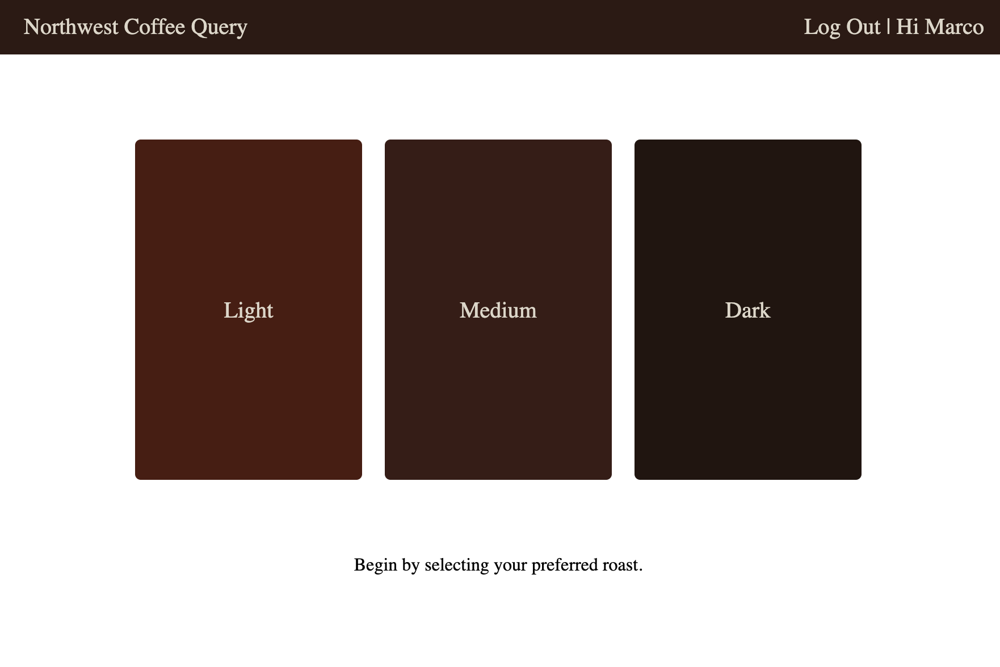
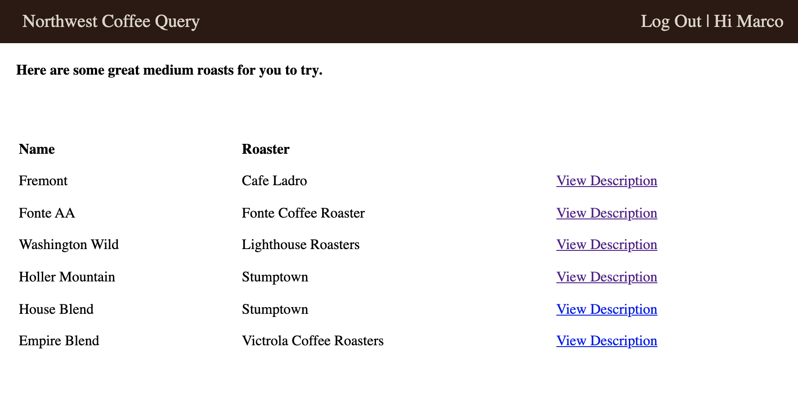
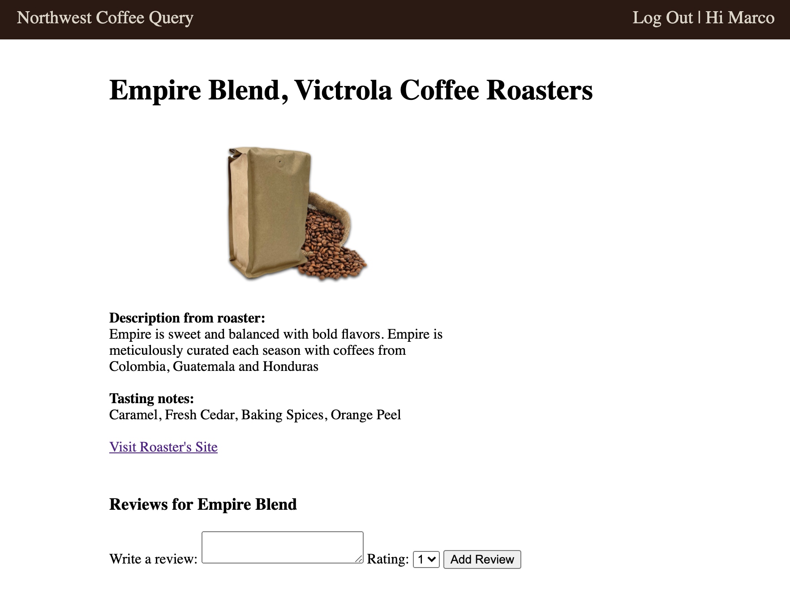

# Northwest Coffee Query

This app was created to help coffee enthusiasts living in the Pacific Northwest find their perfect cup. Users are first prompted to select their preferred roast type and are then given a curated list of local cofeees to try. Here upon clicking "View Description", users can see reviews for a particular coffee and can write a review of their own after logging in with Google OAuth. Finally, users can update or delete their own reviews if they so choose. 

# Screenshots

 

 

# Technologies Used
HTML, CSS, Javascript, Node, Mongoose, MongoDB

# Getting Started

[Launch App](https://northwestcoffeequery.herokuapp.com/coffees)

# Next Steps

Plans for future enhancements to this application include an additional page that allows the user to query coffee by taste preference in addition to roast type. This would include attributes such as "chocolate", "fruity", "floral" etc. Additionally the image on the description page is a placeholder for the particular coffee bag that was selected.  Furthermore styling improvements are ongoing. 